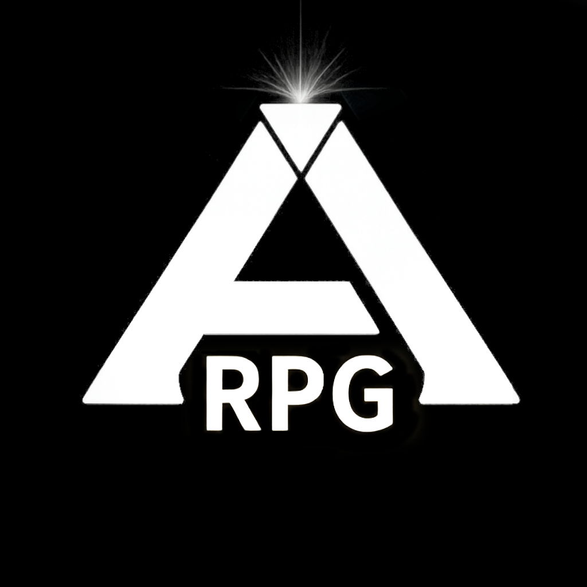

  

<h1 align="center">Ark RPG</h1>
# Ark RPG

Plataforma web completa para gerenciamento de campanhas, personagens e sessões de um RPG inspirado no universo de sobrevivência, evolução e exploração de **ARK: Survival Evolved**.

> **Aviso de direitos:** Projeto independente criado por fã. ARK: Survival Evolved e todos os seus elementos relacionados pertencem aos respectivos criadores e detentores de direitos. Este projeto não possui vínculo oficial com a desenvolvedora ou publicadora do jogo original.

**Aplicação publicada:** [rpgark.com.br](https://rpgark.com.br)

---

## Índice

- [Visão Geral](#visão-geral)
- [Destaques do Projeto](#destaques-do-projeto)
- [Stack Tecnológica](#stack-tecnológica)
- [Arquitetura](#arquitetura)
- [Funcionalidades](#funcionalidades)
- [Rotas](#rotas)
- [Modelo de Dados](#modelo-de-dados)
- [Segurança e Autorização](#segurança-e-autorização)
- [Frontend e Assets](#frontend-e-assets)
- [Ambientes](#ambientes)
---

## Visão Geral

O **Ark RPG** é uma aplicação web desenvolvida em **Laravel 12** que centraliza toda a experiência de um sistema de RPG de mesa inspirado em ARK: Survival Evolved. O projeto foi criado para eliminar fichas físicas desorganizadas e oferecer uma plataforma profissional, intuitiva e imersiva para jogadores e mestres.

Toda a identidade visual é original, com estética tecnológica, selvagem e futurista, incluindo:

- Interface com temas dinâmicos por origem e peculiaridade de personagem.
- Sistema de atributos com árvore visual interativa.
- Elementos de DNA, scanlines e efeitos neón personalizados.
- Ícones, sprites e imagens temáticas próprias.

---

## Destaques do Projeto

O Ark RPG possui diferenciais técnicos e funcionais que o destacam como uma aplicação completa e robusta:

### Sistema de Fichas Totalmente Personalizável

- Fichas de personagem com **identidade visual dinâmica** baseada em origem e peculiaridade.
- **Tema de fundo configurável** por ficha, com upload de imagem personalizada.
- Sistema de **mutações, bônus, poderes e rituais** dinâmicos e ilimitados.
- Árvore de atributos **interativa** com posicionamento de pontos.
- **Exportação em PDF** com modelo próprio, incluindo capa temática, atributos, história, inventário e todos os componentes.
- **Compartilhamento por código** único com sistema de **resgate** que cria cópias completas.

### Mesa Online com Visibilidade em Tempo Real

- Criação de sessões com **código único** por mestre.
- **Atualizações em tempo real** via Server-Sent Events (SSE).
- Visualização instantânea das rolagens de todos os participantes.
- Sistema de **reconexão automática** com fallback para polling.
- Busca de jogadores por **Crystal ID** com consulta de últimas rolagens.

### Livro de Regras Próprio

- Manual completo do sistema RPG-Ark desenvolvido para o projeto.
- Baseado em mecânicas consolidadas de sistemas famosos, adaptado para o universo ARK.
- Página pública com download em PDF.
- Sistema de **eventos aleatórios** com múltiplas categorias (sobrevivência, efeitos, itens, minérios, raridades, drops, traumas, joias, frutas).

### Progressive Web App (PWA)

- Aplicação **instalável** em Android, iOS, Windows e macOS.
- **Service Worker** com estratégias diferenciadas de cache.
- **Funciona offline** para páginas já visitadas.
- **Atalhos rápidos** (Fichas, Rolagens, Criar Ficha).
- Sistema de **verificação e aplicação de atualização** com controle manual.
- Botão flutuante de instalação para visitantes.
- Instruções específicas para iPhone.

### Minijogo Criativo — Dino Runner

- Inspirado no jogo offline do Chrome, mas com **engine própria**.
- Sprites, sons e efeitos visuais originais.
- Sistema de **recorde persistido** no servidor com fallback offline.
- Dificuldade progressiva com spawn dinâmico de obstáculos.
- Controles touch para mobile e suporte completo a teclado.

---

## Stack Tecnológica

### Backend

| Tecnologia | Versão | Uso |
| --- | --- | --- |
| PHP | ^8.2 | Linguagem base |
| Laravel Framework | ^12.0 | Framework principal |
| Laravel Breeze | ^2.4 | Autenticação scaffold |
| Laravel Tinker | ^2.10.1 | REPL para debug |
| Eloquent ORM | — | Mapeamento objeto-relacional |
| Pest | ^3.8 | Framework de testes |
| PHPUnit | — | Suíte de testes subjacente |
| Resend PHP | ^1.3 | Integração de e-mail em produção |

### Frontend

| Tecnologia | Versão | Uso |
| --- | --- | --- |
| Blade | — | Sistema de templates |
| Alpine.js | — | Interatividade client-side |
| Tailwind CSS | ^3.1 | Framework CSS utility-first |
| Vite | ^7.0.7 | Build tool e dev server |
| Laravel Vite Plugin | — | Integração Vite-Laravel |
| Axios | — | Requisições HTTP |
| PostCSS | — | Processamento CSS |
| Autoprefixer | — | Prefixos CSS automáticos |

### Infraestrutura

| Componente | Detalhe |
| --- | --- |
| Hospedagem | Hostinger (plano compartilhado) |
| Domínio | Registro.br (rpgark.com.br) |
| SSL | Ativo (obrigatório para PWA) |
| Banco de dados | MySQL |
| Deploy | Manual via Git + configuração de public_html |

---

## Arquitetura

O projeto segue rigorosamente o padrão **MVC** do Laravel:
Ark-RPG/
├── app/
│ ├── Http/Controllers/ Controllers web e autenticação
│ ├── Http/Requests/ Validações reutilizáveis
│ ├── Http/ViewComposers/ Dados compartilhados com views
│ ├── Models/ Entidades Eloquent
│ └── View/Components/ Componentes Blade
├── bootstrap/cache/ Cache gerado pelo Laravel
├── config/
│ └── eventos.php Configuração de eventos aleatórios
├── database/
│ ├── factories/
│ ├── migrations/
│ └── seeders/
├── public/
│ ├── build/ Saída compilada do Vite
│ ├── images/ Imagens, sprites e fundos temáticos
│ ├── icons/ Ícones PWA
│ ├── pdfs/ Manuais em PDF
│ ├── manifest.webmanifest Manifest PWA
│ └── sw.js Service Worker
├── resources/
│ ├── css/
│ ├── js/
│ └── views/
├── routes/
│ ├── web.php
│ └── auth.php
├── storage/
├── tests/
├── composer.json
├── package.json
└── vite.config.js

### Padrões Arquiteturais

- **Models** representam usuários, fichas, componentes de ficha, rolagens e sessões.
- **Controllers** concentram fluxos HTTP e regras de negócio.
- **Views Blade** renderizam páginas e componentes com identidade visual própria.
- **Routes** separam áreas públicas, autenticadas e de mestre.
- **Migrations** versionam o banco de dados.
- **Middleware** protegem autenticação, verificação de e-mail e CSRF.

---

## Funcionalidades

### Sistema de Conta

- Cadastro, login e logout completos.
- Verificação e reenvio de verificação de e-mail.
- Recuperação, redefinição e alteração de senha.
- Confirmação de senha e exclusão da conta.
- Perfil com foto/avatar e personalização visual.
- Crystal ID público gerado automaticamente para cada usuário (formato `CRY-XXXXXXXX`).
- Cargo de usuário (`jogador` ou `mestre`) que define permissões de acesso à mesa.

Fluxo implementado com Laravel Breeze em `routes/auth.php` e `app/Http/Controllers/Auth`.

### Fichas de Personagem

O sistema de fichas é o núcleo do projeto, com personalização completa:

| Recurso | Descrição |
| --- | --- |
| Identificação | Nome, nível, idade, origem (classe principal) e peculiaridade (subclasse) |
| Aparência | Upload de imagem com processamento e preview |
| Tema de Fundo | Imagem personalizada com suporte a múltiplos formatos (JPG, PNG, WEBP, GIF, BMP) |
| Validação de Upload | Tamanho entre 10 KB e 8 MB com feedback visual em caso de erro |
| Atributos | Força (FOR), Agilidade (AGI), Inteligência (INT), Vigor (VIG) e Sorte (SET) |
| Status Vitais | Vida, Armadura, Determinação, Fôlego e Resistência |
| Lore | Campo de texto rico para história do personagem |
| Arsenal | Estrutura JSON/array para armas e equipamentos |
| Componentes | Mutações, bônus, poderes de sobrevivente e rituais ilimitados |
| Fixação | Até 3 fichas fixadas por usuário para acesso rápido |
| Compartilhamento | Código único para outro jogador resgatar uma cópia |
| Resgate | Criação de cópia completa com referência à ficha original |
| Exportação | Geração de PDF com design próprio e completo |

Fluxo principal em `CharacterController`. Views em `resources/views/fichas`.

### Sistema de Rolagens

| Recurso | Descrição |
| --- | --- |
| Dados | D4, D6, D8, D10, D12, D20, D100 com animação 3D |
| Uso de Ficha | Atributos e bônus carregados diretamente da ficha selecionada |
| Modos | Somar Tudo ou Maior Valor |
| Bônus Manual | Atalhos rápidos (+5, +10, +15, +20, +25, +30) |
| Eventos | Sistema completo de eventos aleatórios do mundo ARK |
| Crítico | Popup animado para 20 Natural |
| Histórico | Persistência do último resultado por usuário |
| Armas | Cadastro de fórmulas de acerto e dano com rolagem automatizada |

Eventos configurados em `config/eventos.php`, cobrindo:

- Sobrevivência
- Efeitos
- Itens
- Minérios
- Raridades
- Drops
- Traumas
- Joias
- Frutas

### Mesa Online em Tempo Real

| Recurso | Descrição |
| --- | --- |
| Criação | Mestre gera código único de sessão |
| Entrada | Jogadores entram usando o código |
| Tempo Real | Rolagens visíveis instantaneamente para todos |
| Protocolo | Server-Sent Events (SSE) com heartbeat e polling de fallback |
| Busca | Consulta de jogadores por Crystal ID |
| Encerramento | Mestre pode encerrar a mesa |
| Controle | Impede entrada duplicada na mesma sessão |

A comunicação SSE é implementada em `/sessao/stream` com estratégia de reconexão automática. O componente `<x-rolagens-sistema>` é reutilizado tanto na página do mestre quanto na do jogador.

### Manual de Regras

- Página pública em `/regras` com design temático e efeito de scanner animado.
- Download do PDF do manual oficial.
- Seção dedicada ao Ark Mobile (PWA) com botão de instalação e verificação de atualização.
- Meta tags de prévia social (Open Graph e Twitter Cards) para compartilhamento.
- Sistema de eventos aleatórios integrado.

### Minijogo Dino Runner

| Recurso | Descrição |
| --- | --- |
| Engine | Física customizada de pulo, gravidade, agachamento e colisão |
| Sprites | Dino correndo, pulando, agachando e morte |
| Obstáculos | Cactos variados e pássaros (desbloqueados após 16 segundos) |
| Recorde | Persistido no servidor com fallback em localStorage |
| Efeitos | Estrelas, nuvens animadas, ondas de terreno e grade neon |
| Áudio | Efeitos sonoros gerados via Web Audio API |
| Dificuldade | Progressiva com spawn dinâmico de obstáculos |
| Responsividade | Controles touch para mobile e suporte a teclado |

### PWA — Ark Mobile

| Recurso | Descrição |
| --- | --- |
| Manifest | Nome, ícones, cores e atalhos rápidos |
| Service Worker | Estratégias de cache diferenciadas |
| Instalação | Botão flutuante e fluxo guiado |
| Offline | Cache de páginas visitadas com view de contingência |
| Atualização | Verificação manual e aplicação com reinício |
| iPhone | Instruções específicas para instalação no Safari |
| Standalone | Detecção de execução como app e ocultação de botões |

Estratégias de cache do Service Worker:

| Recurso | Estratégia |
| --- | --- |
| Assets estáticos (CSS, JS, imagens, fontes) | Cache-first |
| Páginas HTML | Network-first com fallback offline |
| Imagens de usuário (/media/) | Cache-first |
| Rotas sensíveis | Sem cache |

Rotas excluídas do cache:

- `/sessao/stream`
- `/dino-record`
- `/rolagens/save`
- `/rolagens/arma`
- `/mestre/*`
- `/sessao/*`
- `/profile/*`

---

## Rotas

Use `php artisan route:list` para conferir a assinatura exata do ambiente atual.

### Rotas Públicas

| Método | URI | Identificação |
| --- | --- | --- |
| GET | / | Página inicial (home) |
| GET | /regras | Página de regras |
| GET | /regras/download | Download do PDF do manual |
| GET | /offline | View de contingência offline |
| GET | /jogo | Minijogo Dino Runner |
| GET | /media/{path} | Entrega de mídia |

### Rotas Autenticadas

Exigem `auth` e `verified`.

#### Fichas

| Método | URI | Operação |
| --- | --- | --- |
| GET | /fichas | Listar fichas |
| GET | /fichas/create | Formulário de criação |
| POST | /fichas | Criar ficha |
| GET | /fichas/{ficha} | Visualizar ficha |
| GET | /fichas/{ficha}/edit | Editar ficha |
| PUT/PATCH | /fichas/{ficha} | Atualizar ficha |
| DELETE | /fichas/{ficha} | Excluir ficha |
| POST | /fichas/{ficha}/share | Gerar código de compartilhamento |
| POST | /fichas/resgatar | Resgatar ficha por código |
| POST | /fichas/{ficha}/pin | Fixar/desafixar ficha |

#### Rolagens

| Método | URI | Operação |
| --- | --- | --- |
| GET | /rolagens | Interface de rolagens |
| GET | /rolagens/char/{id} | Carregar ficha em JSON |
| POST | /rolagens/save | Salvar último resultado |
| POST | /rolagens/arma/salvar | Salvar arma no arsenal |

#### Perfil, Jogo e Recorde

| Método | URI | Operação |
| --- | --- | --- |
| GET | /perfil | Perfil da aplicação |
| GET | /profile | Perfil Breeze |
| PATCH | /profile | Atualizar perfil |
| DELETE | /profile | Excluir conta |
| GET | /dino-record | Consultar recorde |
| POST | /dino-record | Salvar recorde |

### Rotas do Mestre

Exigem autenticação. O controller verifica `cargo = mestre`.

| Método | URI | Operação |
| --- | --- | --- |
| GET | /mestre/mesa | Abrir painel da mesa |
| GET | /mestre/buscar/{crystalId} | Buscar jogador |
| POST | /mestre/criar-mesa | Criar sessão |
| GET | /mestre/sessao/{code} | Abrir sessão |
| GET | /mestre/sessao/{code}/participantes | Listar participantes |
| POST | /mestre/sessao/{code}/encerrar | Encerrar sessão |

### Rotas de Sessão de Jogador

| Método | URI | Operação |
| --- | --- | --- |
| GET | /sessao/entrar | Formulário de entrada |
| POST | /sessao/entrar | Entrar por código |
| GET | /sessao/minha-sessao | Consultar sessão ativa |
| GET | /sessao/stream | Stream SSE em tempo real |
| POST | /sessao/sair | Sair da sessão |

### Rotas de Autenticação

Implementadas pelo Laravel Breeze em `routes/auth.php`:

- Registro
- Login e logout
- Verificação de e-mail
- Recuperação de senha
- Confirmação de senha
- Atualização de senha

---

## Modelo de Dados

### User (users)

| Campo | Descrição |
| --- | --- |
| id | Identificador único |
| name | Nome do usuário |
| email | E-mail |
| password | Senha criptografada |
| crystal_id | Identificador público único |
| cargo | jogador ou mestre |
| foto | Caminho do avatar |
| dino_record | Recorde do minijogo |

Relacionamento: possui muitas fichas. Gera `crystal_id` no evento `creating`.

### Character (fichas)

| Campo | Descrição |
| --- | --- |
| id | Identificador único |
| user_id | Proprietário |
| name | Nome do personagem |
| image | Imagem do personagem |
| background_image | Imagem de fundo personalizada |
| level | Nível |
| age | Idade |
| class_main | Origem |
| class_sub | Peculiaridade |
| lore | História do personagem |
| arsenal | Armas e equipamentos (JSON) |
| for, agi, int, set, vig | Atributos |
| vida, armadura, determinacao, folego, resistencia | Status vitais |
| share_code | Código de compartilhamento |
| is_resgatada | Indica se foi resgatada |
| is_pinned | Indica se está fixada |
| original_user_id | Usuário criador original |
| original_character_id | Ficha original |

Relacionamentos: User, Mutation, Bonus, SurvivorPower, Ritual.

### Componentes de Ficha

| Modelo | Tabela | Descrição |
| --- | --- | --- |
| Mutation | mutations | Mutações genéticas |
| Bonus | bonuses | Bônus incrementais |
| SurvivorPower | survivor_powers | Poderes de sobrevivente |
| Ritual | rituals | Rituais e pactos |

### Rolagens e Sessões

| Modelo | Tabela | Descrição |
| --- | --- | --- |
| RollLog | roll_logs | Último resultado de rolagem |
| Session | game_sessions | Sessão de mesa |
| SessionParticipant | game_session_participants | Participantes de sessão |

### Infraestrutura Laravel

- sessions
- password_reset_tokens
- cache
- cache_locks

---

## Segurança e Autorização

### Mecanismos Implementados

- Guard padrão `web` para autenticação de sessão.
- CSRF em todos os formulários protegidos.
- Middleware `auth` e `verified` em rotas de fichas, rolagens, perfil e recorde.
- Middleware `auth` em rotas de mestre e sessões.
- Verificação de propriedade de ficha por comparação de `user_id`.
- Cargo de mestre identificado pelo campo `users.cargo`.
- Upload seguro com validação de MIME type, extensão e tamanho.
- Códigos de compartilhamento gerados com `Str::random(8)` e verificados quanto a unicidade.

### Recomendações Futuras

- Centralizar regras sensíveis em Policies/Gates.
- Proteger ou remover rotas de manutenção (`/limpar-cache`, `/criar-link-storage`, `/test-419`).
- Implementar rate limiting em rotas de autenticação e APIs.
- Adicionar logging de auditoria para ações críticas.

---

## Frontend e Assets

O frontend combina Blade, Tailwind CSS, Alpine.js, Axios e JavaScript próprio.

### Estrutura

| Diretório | Conteúdo |
| --- | --- |
| public/images | Fundos temáticos, sprites, ícones de eventos e watermarks |
| public/img | Logos e imagens auxiliares |
| public/pdfs | Manuais em PDF |
| public/icons | Ícones PWA (192, 512, maskable, apple-touch) |
| public/build | Saída compilada do Vite |
| public/storage | Armazenamento público (link simbólico) |

### Views

| Diretório | Responsabilidade |
| --- | --- |
| views/fichas | CRUD de fichas (index, create, edit, show) |
| views/rolagens | Interface de rolagens e mesa |
| views/master | Mesa e sessão do mestre |
| views/session | Entrada e sessão do jogador |
| views/auth | Telas de autenticação |
| views/regras | Manual do sobrevivente |
| views/components | Componentes Blade reutilizáveis |
| views/layouts | Layouts mestre e navegação |

---

## Ambientes

### Ambiente Local (Desenvolvimento)

- Repositório completo versionado em Git.
- Configuração via `.env` local com SQLite ou MySQL.
- Execução via `php artisan serve` combinado com `npm run dev`.
- PWA funciona em `localhost` (considerado contexto seguro).

### Ambiente de Produção (Hostinger)

- Hospedagem compartilhada Hostinger.
- Domínio registrado no Registro.br.
- Banco de dados MySQL.
- SSL ativo.
- Deploy manual via Git com arquivos públicos direcionados para `public_html`.
- Detalhes de credenciais e configuração do painel não fazem parte do repositório.
